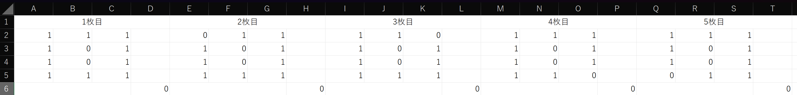
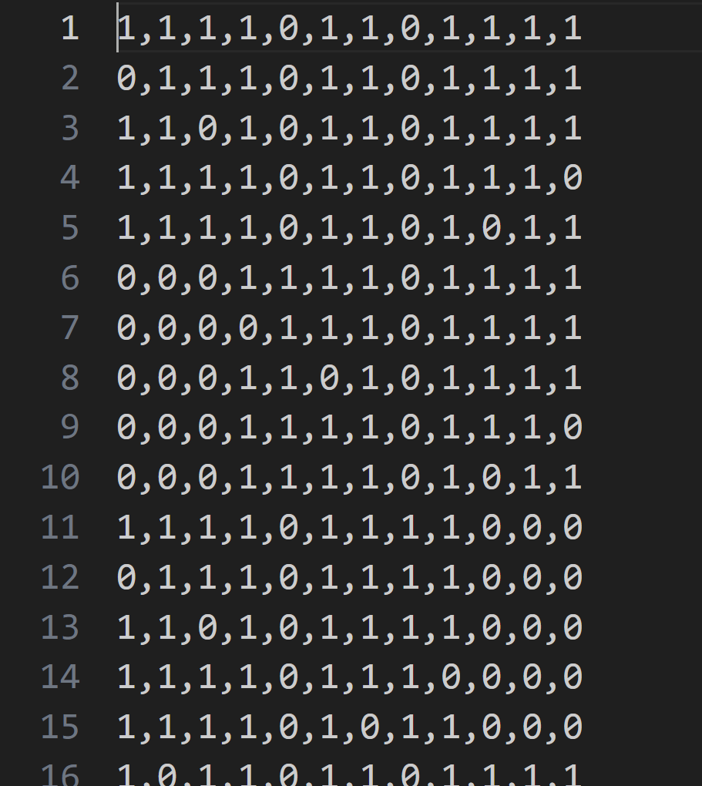
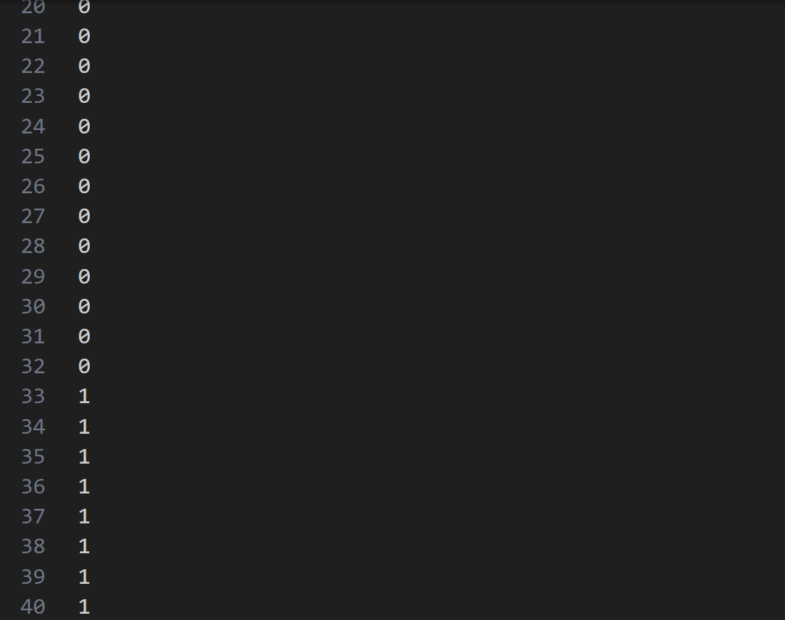

# データセットの説明
64枚分の「０」「１」の画像データを用意しました。
実装の際に是非ご活用ください。

## 各ファイルの説明
### `学習データ・正解データ.xlsx`
以下のような形で学習データと正解データの組が列挙されているファイルです。

$4 \times 3$ のグリッドに表されている部分が画像データ、その下（6行目）の部分が正解データを表しています。

csv ではないので、学習データを配列にそのままコピペする人向けのファイルになっています。

### `学習データ.csv`
画像データをカンマ区切りで列挙した64枚分の画像データのファイルです。

画像データの各ピクセル $x_1,\ x_2,\ \dots, x_{12}$ が横1列に並んだ状態になっています。

csv でデータを取り込む人向けのファイルになっています。

### `正解データ.csv`
画像データに対応する正解データを列挙した正解データのファイルです。

`学習データ.csv` と同じ並び順で対応する正解データが列挙されていることに注意が必要です。

csv でデータを取り込む人向けのファイルになっています。
